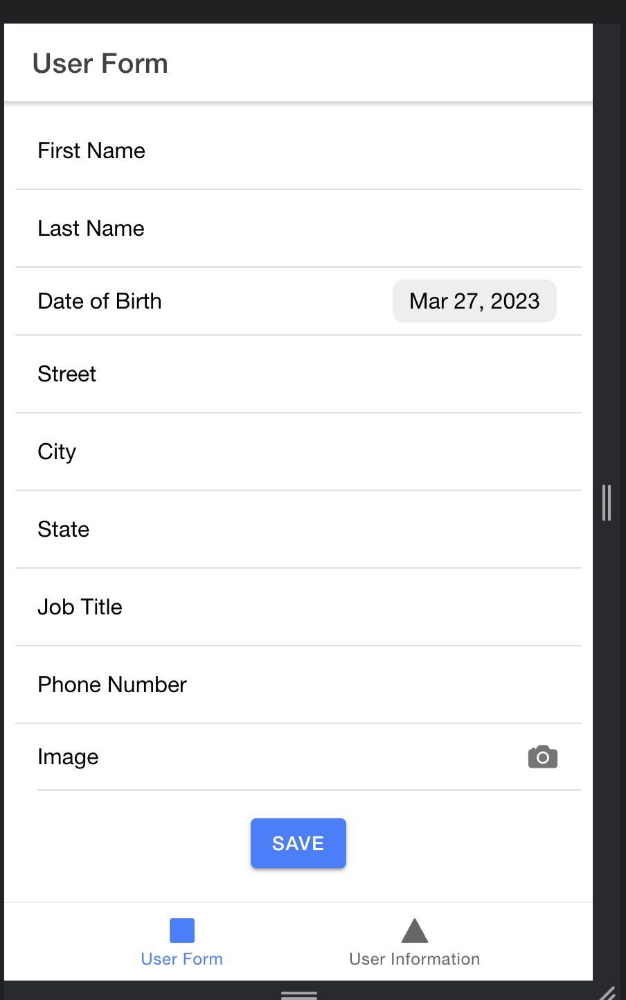
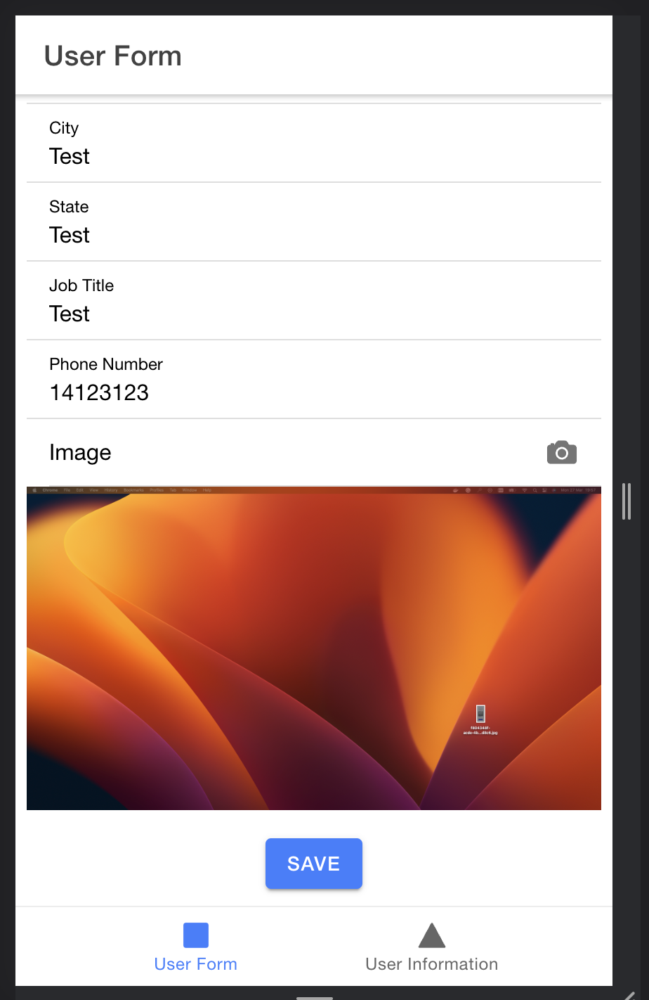
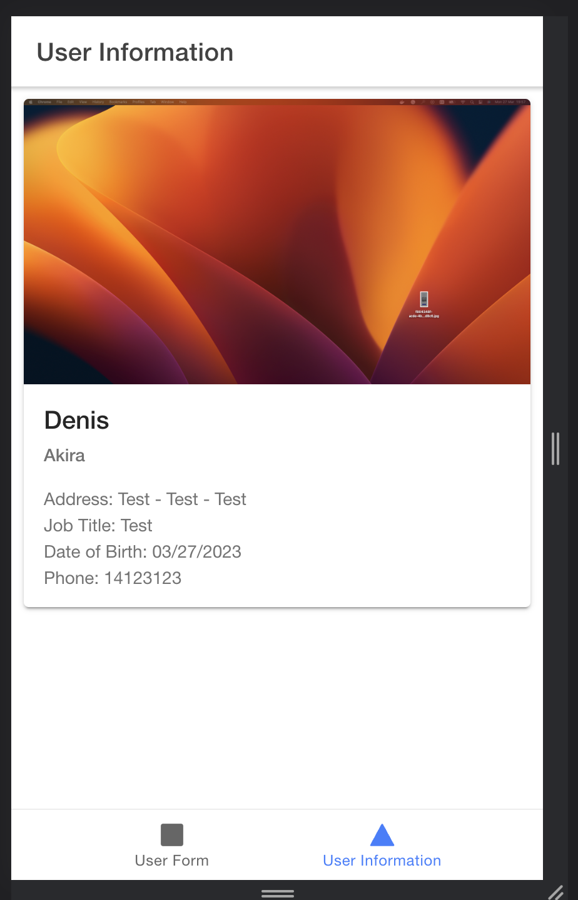
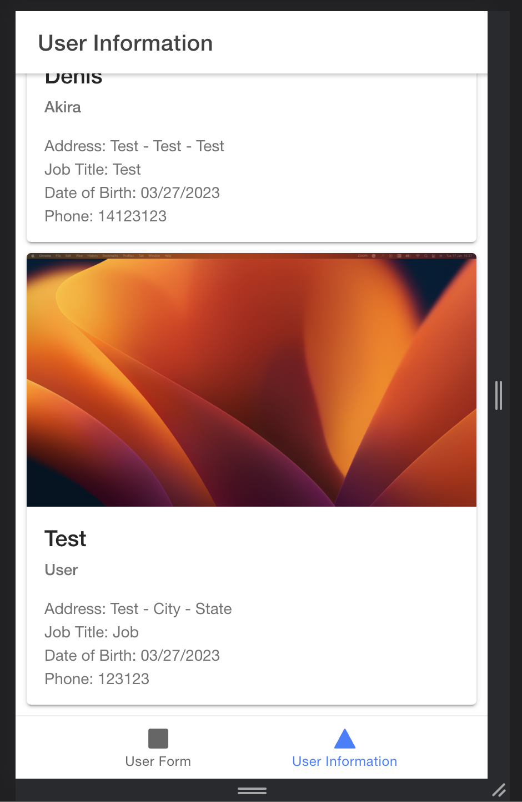

# Ionic and Nest.js POC

POC for a Ionic application with Nest.js backend.

## Screenshots

Form tab with empty form

Form tab with filled form

Information tab with one user registered

Information tab with multiple users registered

